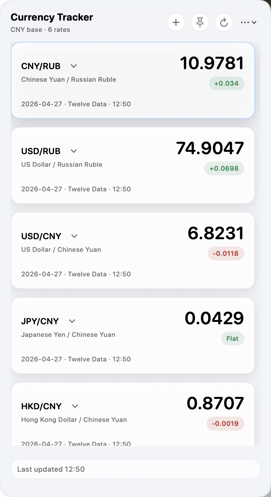
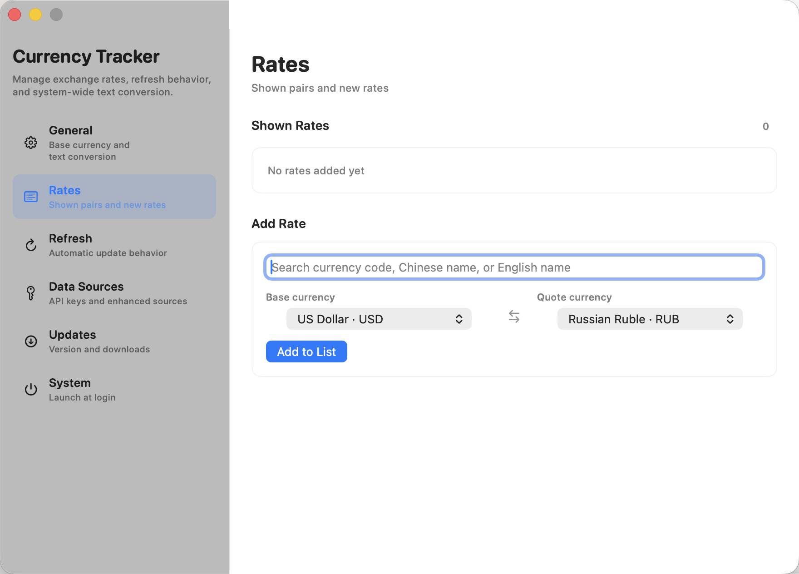
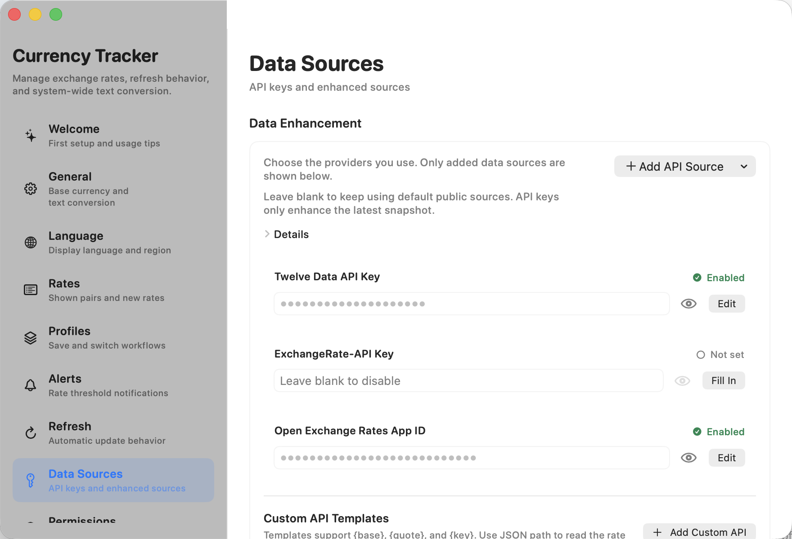

# Currency Tracker

Currency Tracker is a lightweight macOS menu bar app for checking the exchange rates you use every day. It keeps frequently viewed currency pairs one click away, supports quick conversion, and lets you bring your own API keys when you want enhanced rate sources.

  <a href="https://github.com/Agumuzi/Currency_Tracker/releases/latest"><strong>Download the latest release</strong></a>
  ·
  <a href="https://agumuzi.github.io/Currency_Tracker/">Product page</a>
  ·
  <a href="https://github.com/Agumuzi/Currency_Tracker/releases">Release notes</a>

## Screenshots

### Menu bar panel

### Settings

| Rates and pair management | API data sources |
| --- | --- |
|  |  |

## Highlights

- View selected currency pairs directly from the macOS menu bar.
- Choose how much information appears in the menu bar: icon only, a featured rate, or a compact pair label.
- Switch between rate history and conversion from the same compact panel.
- Add, remove, reorder, and manage the pairs shown in the panel.
- Save settings profiles for different work contexts and switch between them quickly.
- Create threshold alerts for important exchange rates.
- Convert selected text through macOS Services or a global shortcut.
- Use public fallback sources by default, enable mainstream provider credentials, or add a custom JSON API template.
- Check for updates from Settings, with optional automatic update checks.
- Export a diagnostics report for troubleshooting without including API keys.
- Run the interface in English, Russian, or Simplified Chinese.

## Data Sources

Currency Tracker works without user-provided API keys by falling back to public exchange-rate sources. For better coverage and reliability, you can add credentials for these providers from Settings:

- Twelve Data
- ExchangeRate-API
- Open Exchange Rates
- Fixer
- Currencylayer

Credentials are stored locally on your Mac under Application Support. External providers only receive the exchange-rate requests needed for refreshes.

## Version 1.3

Version 1.3 focuses on maturity, workflow depth, and distribution readiness:

- Added a provider picker for custom API data sources.
- Added support for ExchangeRate-API, Fixer, and Currencylayer alongside the existing enhanced sources.
- Updated API credential rows with clear enabled states and edit actions.
- Added settings profiles, threshold alerts, menu bar display modes, permissions status, and diagnostics export.
- Refined the menu bar cards, scrolling behavior, panel pinning, chart styling, and settings layout.
- Added software update checks and automatic update preferences.
- Added CI checks, a release packaging workflow, and localization consistency validation.
- Reworked the README with English copy and screenshots of the main app surfaces.

## Installation

Download `Currency-Tracker-1.3.zip` from the latest GitHub release, unzip it, and move `Currency Tracker.app` to your Applications folder.

The app is distributed through GitHub Releases and is not notarized through Apple. On first launch, macOS may block it. Open:

`System Settings` -> `Privacy & Security` -> `Open Anyway`

After you approve it once, future launches should work normally.

## Requirements

- macOS 14.0 or later
- Internet access for live exchange-rate refreshes

## Privacy

Currency Tracker is designed as a local-first utility. Preferences, selected pairs, refresh behavior, and API credentials are stored on your Mac. The app does not upload local files, clipboard contents, or device data to any backend service owned by this project.

## Distribution

Source code and packaged builds are available on GitHub:

- [Repository](https://github.com/Agumuzi/Currency_Tracker)
- [Releases](https://github.com/Agumuzi/Currency_Tracker/releases)
