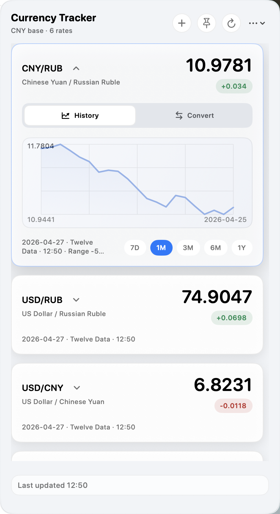
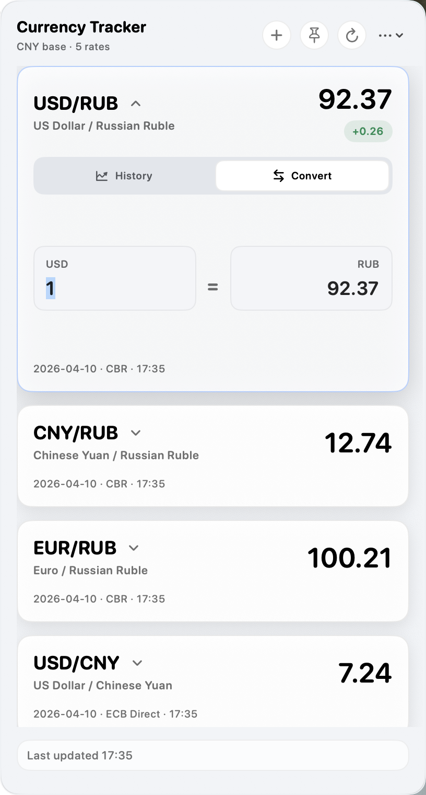
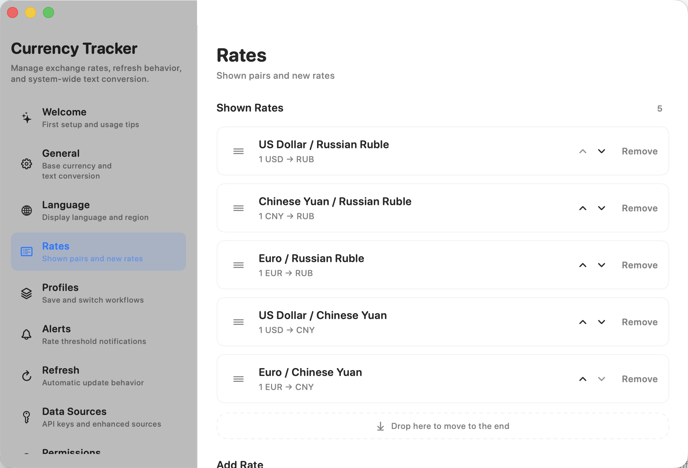
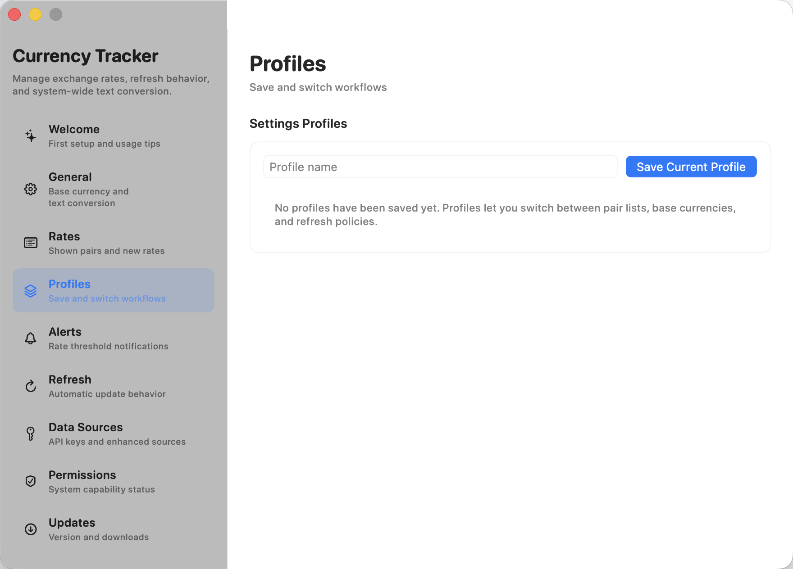
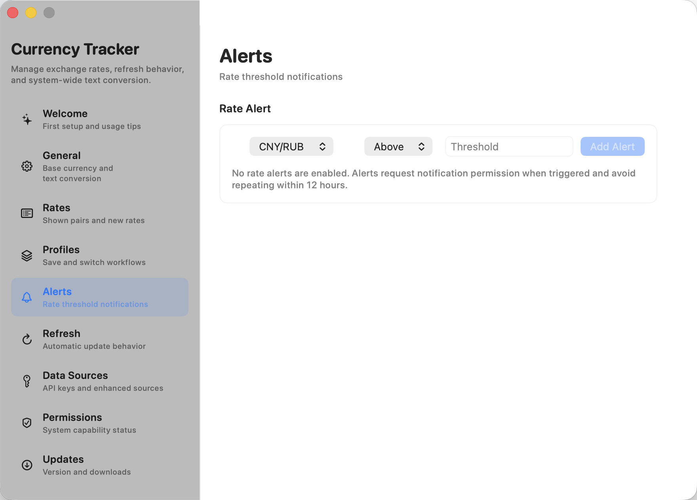
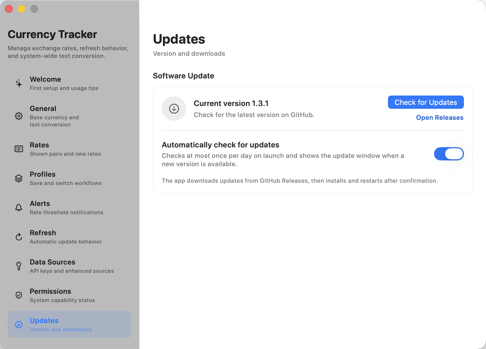

# Currency Tracker

Currency Tracker is a macOS menu bar app for exchange rates, quick conversion, and system-wide selected-text currency conversion. It is built for people who check a small set of rates repeatedly and want the workflow to stay close to the menu bar.

  <a href="https://github.com/Agumuzi/Currency-Tracker/releases/latest"><strong>Download latest release</strong></a>
  ·
  <a href="https://agumuzi.github.io/Currency-Tracker/">Product page</a>
  ·
  <a href="https://github.com/Agumuzi/Currency-Tracker/releases">Release notes</a>

  

## What It Does

- Keeps selected exchange-rate pairs one click away in the macOS menu bar.
- Shows compact cards with latest rates, source, refresh time, and positive or negative movement badges.
- Expands any card into a history chart or a two-way converter.
- Switches the menu bar panel between the rate list and a multi-currency converter.
- Lets you choose whether rates display as `1 BASE` or `100 BASE`, with fixed 2, 4, or 6 decimal places.
- Lets you add, remove, reorder, and search currency pairs from the ISO currency catalog supported by your configured data sources.
- Converts selected text from other apps through macOS Services or a global shortcut.
- Supports English, Simplified Chinese, Traditional Chinese, Russian, Japanese, Korean, French, German, Spanish, Brazilian Portuguese, and Italian.
- Stores preferences and API credentials locally on your Mac without using the system Keychain.

## Screenshots

### Menu Bar Workflow

| Rate list | History chart | Inline conversion |
| --- | --- | --- |
|  |  |  |

### Settings And Configuration

| Welcome | Rates | Data sources |
| --- | --- | --- |
|  |  |  |

| Profiles | Alerts | Updates |
| --- | --- | --- |
|  |  |  |

## Main Features

### Menu Bar Rates

Choose the pairs you care about and keep them in a compact menu bar panel. The panel supports scrolling when the list grows, a pinned always-on-top mode, manual refresh, and display modes for the menu bar item itself.

### History And Conversion

Each card can expand into a recent trend chart or a converter without leaving the panel. The menu bar panel also has a dedicated converter page that builds a de-duplicated currency list from the currencies you configure. Chart ranges include 7 days, 1 month, 3 months, 6 months, and 1 year when historical data is available.

### Pair Management

The settings window includes a sidebar and dedicated pages for general behavior, language, rate pairs, converter currencies, profiles, alerts, refresh policy, data sources, permissions, updates, diagnostics, and system launch behavior. Converter currencies can follow the selected rate pairs or be managed separately.

### Language And Window Behavior

The app follows macOS per-app language preferences and includes a language page that opens the system Language & Region settings directly. The menu bar panel stays anchored to the status item, while the pinned panel and settings window can be resized when larger pair lists or localized labels need more room.

### Data Sources

Currency Tracker works with public fallback sources by default. For personal use, the recommended enhanced sources are [Twelve Data](https://twelvedata.com/) and [Open Exchange Rates](https://openexchangerates.org/) because both provide free tiers: Twelve Data offers 800 free API credits per day, which is about 100 full multi-pair refreshes in Currency Tracker, while Open Exchange Rates offers 1,000 free requests per month.

You can also add credentials for other mainstream providers when you need broader coverage or reliability:

- [Twelve Data](https://twelvedata.com/)
- ExchangeRate-API
- [Open Exchange Rates](https://openexchangerates.org/)
- Fixer
- Currencylayer
- Custom JSON API templates with `{base}`, `{quote}`, and `{key}` placeholders, secure entry, enable/edit states, and a built-in connection test

### Profiles And Alerts

Save different pair lists and refresh settings as profiles, then switch between them for different workflows. Rate alerts can watch selected pairs and request notification permission when a threshold is triggered.

### Updates

The app can check GitHub Releases from Settings. Update packages are downloaded, verified with SHA256 checksums, prepared, installed, relaunched, and cleaned up inside the app after user confirmation.

## Current Release

Version `1.5.5` includes:

- Fixes global text-conversion shortcut reliability after Accessibility permission changes.
- Adds an Accessibility-backed global key monitor fallback alongside the Carbon hot key registration.
- Improves selected-text copy fallback timing and restores the previous clipboard contents after reading.
- Allows converter inputs to evaluate basic calculations such as `100+20`, `100 - 25=`, `12*3`, `10/4`, and `(2+3)*4`.
- Updates the in-app update checker to use the public `Agumuzi/Currency-Tracker` GitHub repository.

## Installation

Download `Currency-Tracker-1.5.5.zip` from the latest GitHub release, unzip it, and move `Currency Tracker.app` to your Applications folder. The published SHA256 checksum is `ef4b0cad8ad0f43f3a8d524b2c56e177bb94460329e15a76dcdc44aee68647c5`.

The app is distributed through GitHub Releases and is not notarized through Apple. On first launch, macOS may block it. Open:

`System Settings` -> `Privacy & Security` -> `Open Anyway`

After you approve it once, future launches should work normally. Because the app is still unsigned and not notarized, macOS may still ask for approval when replacing the application during an in-app update.

## Requirements

- macOS 14.0 or later
- Internet access for live exchange-rate refreshes

## Privacy

Currency Tracker is local-first. Preferences, selected pairs, refresh behavior, profiles, alerts, and API credentials are stored on your Mac. Provider keys are kept in the app's local Application Support data, not in the macOS Keychain. The app does not upload local files, clipboard contents, or device data to any backend service owned by this project.

External exchange-rate providers only receive the exchange-rate requests needed for the data sources you enable.

## Links

- [Product page](https://agumuzi.github.io/Currency-Tracker/)
- [Repository](https://github.com/Agumuzi/Currency-Tracker)
- [Releases](https://github.com/Agumuzi/Currency-Tracker/releases)
